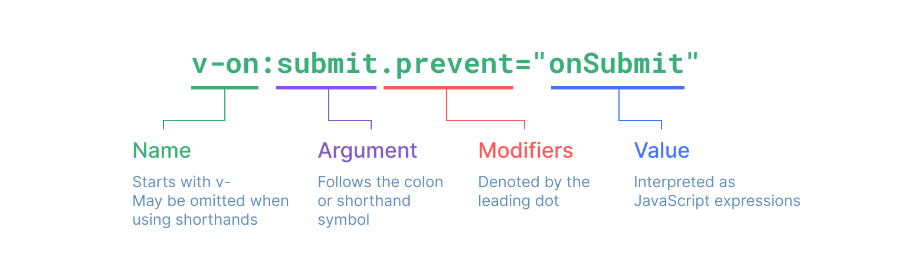
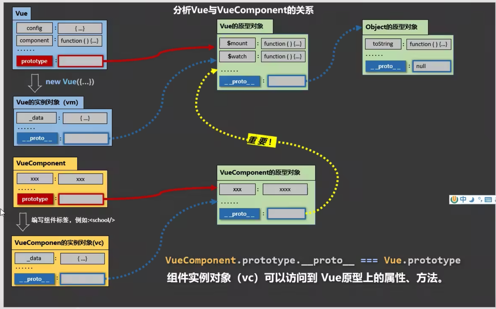
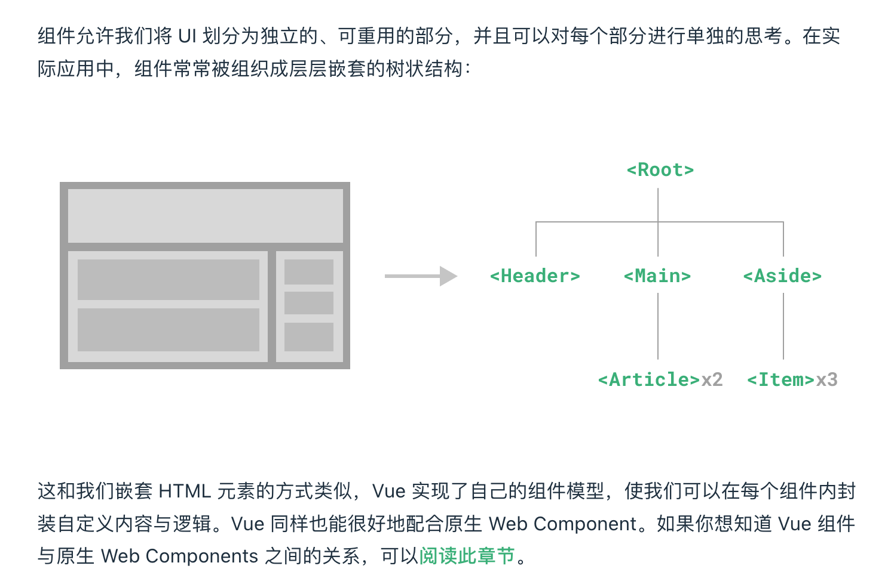
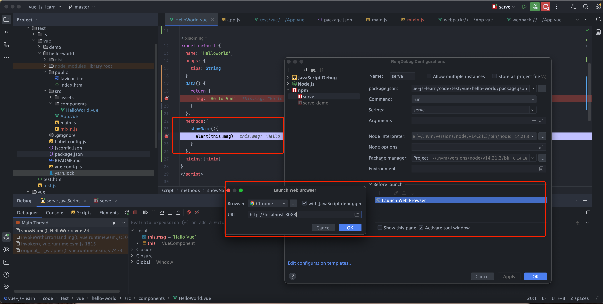

# JavaScript Learn
## JS 基础教程
JavaScript基础&实战 https://www.bilibili.com/video/BV1YW411T7GX

## JS高级教程  
JavaScript高级教程 https://www.bilibili.com/video/BV14s411E7qf  
ES6教程，涵盖ES6-ES11 https://www.bilibili.com/video/BV1uK411H7on  
TypeScript教程 https://www.bilibili.com/video/BV1Xy4y1v7S2


# Vue Learn
Vue官网 https://cn.vuejs.org/  
Vue2.0 https://v2.cn.vuejs.org/  
B站: https://www.bilibili.com/video/BV1Zy4y1K7SH  

### [pdf 前端技术_Vue全家桶](res/files/尚硅谷_前端技术_Vue全家桶.pdf)
### [vue2 教程](code/vue/2_vue_test/README.md)
### [md 前端技术_Vue全家桶](md/vue3快速上手.md)

### 关系图
**生命周期**
<br>
<div align=center>
	</img>  
</div>
<br>

指令语法
<br>
<div align=center>
	</img>  
</div>
<br>

<br>
<div align=center>
	</img>  
</div>
<br>
> vm与vc之间的关系

组件概念
<br>
<div align=center>
	</img>  
</div>
<br>

### idea 调试vue, 可以debug js  
<br>
<div align=center>
	</img>  
</div>
<br>

## 疑问拓展
### 去掉eslint
```shell
npm remove @vue/cli-plugin-eslint
```

### 缺少less-loader  
```shell
npm i less-loader less
```

# WebPack 
